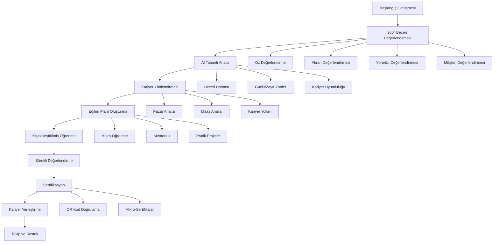
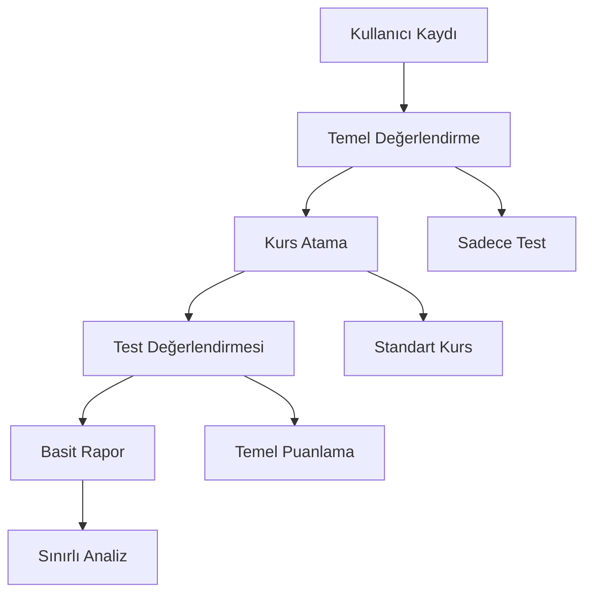

# 📋 Bilan de Compétence Süreci - Detaylı Analiz Raporu

## 🎯 Executive Summary

Bu rapor, eski BDC projeleri (BDC-v2, BDC-v3, 123edof-professional) ile mevcut BDC projesi arasındaki **Bilan de Compétence** süreç farklılıklarını detaylı olarak analiz eder. Bilan de Compétence, Fransa'da profesyonel beceri değerlendirme sürecinin dijitalleştirilmesi için tasarlanmış kapsamlı bir sistemdir.

---

## 🔍 Bilan de Compétence Süreci Nedir?

### Tanım ve Amaç
**Bilan de Compétence**, Fransız iş hukukuna göre çalışanların profesyonel becerilerini, yeteneklerini ve kariyer hedeflerini değerlendiren kapsamlı bir süreçtir. Bu süreç:

- **Beceri Analizi**: Mevcut teknik ve sosyal becerilerin değerlendirilmesi
- **Kariyer Yönlendirmesi**: Gelecek kariyer hedeflerinin belirlenmesi
- **Eğitim Planlaması**: Gerekli eğitim ve gelişim programlarının tasarlanması
- **Sertifikasyon**: Resmi belge ve sertifikaların verilmesi

### Yasal Gereklilikler
- **Fransız İş Kanunu** (Code du Travail) kapsamında
- **24 saatlik** minimum süre zorunluluğu
- **Sertifikalı danışman** gözetimi gerekliliği
- **Gizlilik** ve veri koruma standartları

---

## 📊 Eski Projeler vs Mevcut Proje - Bilan de Compétence Özellikleri

### 1. **Beceri Değerlendirme Sistemi**

#### Eski Projelerde (BDC-v2/v3) ✅
```yaml
Gelişmiş Beceri Değerlendirme:
  - 360° değerlendirme sistemi
  - Akran değerlendirmesi
  - Yönetici geri bildirimi
  - Öz değerlendirme
  - Müşteri değerlendirmesi
  - AI tabanlı beceri analizi
  - Beceri haritası oluşturma
  - Güçlü/zayıf yönler tespiti
  - Kariyer uyumluluğu analizi
```

#### Mevcut Projede ❌
```yaml
Temel Değerlendirme:
  - Sadece test tabanlı değerlendirme
  - Tek yönlü ölçüm
  - Sınırlı beceri kategorisi
  - AI analizi eksik
  - Kariyer yönlendirmesi yok
```

### 2. **Kariyer Yönlendirme ve Planlama**

#### Eski Projelerde ✅
```python
# Gelişmiş Kariyer Yönlendirme Sistemi
class CareerGuidanceSystem:
    def __init__(self):
        self.ai_analyzer = MultiAIModelAnalyzer()
        self.career_paths = CareerPathDatabase()
        self.market_analyzer = JobMarketAnalyzer()
    
    def generate_career_plan(self, user_profile):
        # AI tabanlı kariyer analizi
        skills_analysis = self.ai_analyzer.analyze_skills(user_profile)
        market_opportunities = self.market_analyzer.find_opportunities(skills_analysis)
        career_paths = self.career_paths.recommend_paths(skills_analysis)
        
        return {
            "current_position": skills_analysis.current_level,
            "recommended_paths": career_paths,
            "skill_gaps": skills_analysis.gaps,
            "market_demand": market_opportunities,
            "timeline": self.generate_timeline(career_paths),
            "certifications_needed": self.identify_certifications(career_paths)
        }
```

#### Mevcut Projede ❌
```yaml
Eksik Özellikler:
  - Kariyer yönlendirme sistemi yok
  - Pazar analizi yok
  - Sertifika önerileri yok
  - Kariyer yolu planlaması yok
  - AI tabanlı öneriler yok
```

### 3. **Eğitim ve Gelişim Planlaması**

#### Eski Projelerde ✅
```yaml
Kapsamlı Eğitim Sistemi:
  - Kişiselleştirilmiş öğrenme yolları
  - AI tabanlı içerik önerileri
  - Mikro-öğrenme modülleri
  - Sertifika programları
  - Mentorluk sistemi
  - Akran öğrenme grupları
  - Pratik projeler
  - İş simülasyonları
  - Gerçek dünya uygulamaları
```

#### Mevcut Projede 🔄
```yaml
Temel Eğitim:
  - Standart kurs yapısı
  - Sınırlı kişiselleştirme
  - AI önerileri eksik
  - Mentorluk sistemi yok
  - Pratik uygulama eksik
```

### 4. **Sertifikasyon ve Belgelendirme**

#### Eski Projelerde ✅
```yaml
Gelişmiş Sertifikasyon:
  - QR kod ile doğrulama
  - Uluslararası standartlar
  - Mikro-sertifikalar
  - Beceri rozetleri
  - Dijital kimlik
  - Sertifika geçerlilik takibi
  - Otomatik yenileme
```

#### Mevcut Projede ❌
```yaml
Temel Sertifikasyon:
  - Basit sertifika sistemi
  - Doğrulama sistemi eksik
  - Mikro-sertifikalar yok
```

### 5. **Raporlama ve Analitik**

#### Eski Projelerde ✅
```yaml
Gelişmiş Raporlama:
  - AI tabanlı gelişim raporları
  - Predictive analytics
  - Beceri trend analizi
  - Kariyer başarı tahmini
  - ROI hesaplaması
  - Benchmark karşılaştırması
  - Sektör analizi
  - Maaş artış tahmini
```

#### Mevcut Projede 🔄
```yaml
Temel Raporlama:
  - Basit performans raporları
  - Sınırlı analitik
  - Predictive analytics yok
  - Benchmark yok
```

---

## 🚨 Kritik Eksiklikler - Bilan de Compétence Süreci

### 1. **Yasal Uyumluluk Eksiklikleri** ❌
```yaml
Fransız İş Kanunu Gereksinimleri:
  - 24 saatlik minimum süre takibi yok
  - Sertifikalı danışman atama sistemi yok
  - Yasal rapor formatları eksik
  - Gizlilik protokolleri yetersiz
  - Veri saklama süreleri belirsiz
  - GDPR uyumluluğu eksik
```

### 2. **Beceri Değerlendirme Eksiklikleri** ❌
```yaml
Eksik Değerlendirme Modülleri:
  - 360° değerlendirme sistemi yok
  - Akran değerlendirmesi yok
  - Yönetici geri bildirimi yok
  - Müşteri değerlendirmesi yok
  - Öz değerlendirme eksik
  - Beceri haritası oluşturma yok
  - Güçlü/zayıf yönler analizi yok
```

### 3. **Kariyer Yönlendirme Eksiklikleri** ❌
```yaml
Eksik Kariyer Özellikleri:
  - Kariyer yolu planlaması yok
  - Pazar analizi yok
  - İş fırsatları önerisi yok
  - Maaş analizi yok
  - Sektör trendleri yok
  - Kariyer değişikliği simülasyonu yok
  - Networking önerileri yok
```

### 4. **Eğitim Planlama Eksiklikleri** ❌
```yaml
Eksik Eğitim Özellikleri:
  - Kişiselleştirilmiş öğrenme yolları eksik
  - AI tabanlı içerik önerileri yok
  - Mikro-öğrenme modülleri yok
  - Mentorluk sistemi yok
  - Akran öğrenme grupları yok
  - Pratik projeler eksik
  - İş simülasyonları yok
```

### 5. **Sertifikasyon Eksiklikleri** ❌
```yaml
Eksik Sertifikasyon Özellikleri:
  - QR kod doğrulama yok
  - Mikro-sertifikalar yok
  - Beceri rozetleri yok
  - Dijital kimlik sistemi yok
  - Sertifika geçerlilik takibi yok
```

---

## 🔄 Geliştirilmesi Gereken Özellikler

### 1. **Beceri Değerlendirme Sistemi** (Mevcut: Temel → Hedef: Gelişmiş)
```python
# Eksik 360° Değerlendirme Sistemi
class ComprehensiveAssessmentSystem:
    def __init__(self):
        self.self_assessment = SelfAssessmentModule()
        self.peer_assessment = PeerAssessmentModule()
        self.manager_assessment = ManagerAssessmentModule()
        self.customer_assessment = CustomerAssessmentModule()
        self.ai_analyzer = AIBeceriAnalyzer()
    
    def conduct_360_assessment(self, user_id):
        # Öz değerlendirme
        self_eval = self.self_assessment.evaluate(user_id)
        
        # Akran değerlendirmesi
        peer_eval = self.peer_assessment.evaluate(user_id)
        
        # Yönetici değerlendirmesi
        manager_eval = self.manager_assessment.evaluate(user_id)
        
        # Müşteri değerlendirmesi
        customer_eval = self.customer_assessment.evaluate(user_id)
        
        # AI analizi
        ai_analysis = self.ai_analyzer.analyze_all_evaluations([
            self_eval, peer_eval, manager_eval, customer_eval
        ])
        
        return {
            "skill_map": ai_analysis.skill_map,
            "strengths": ai_analysis.strengths,
            "weaknesses": ai_analysis.weaknesses,
            "development_areas": ai_analysis.development_areas,
            "career_recommendations": ai_analysis.career_recommendations
        }
```

### 2. **Kariyer Yönlendirme Sistemi** (Mevcut: Yok → Hedef: Kapsamlı)
```python
# Eksik Kariyer Yönlendirme Sistemi
class CareerGuidanceSystem:
    def __init__(self):
        self.market_analyzer = JobMarketAnalyzer()
        self.salary_analyzer = SalaryAnalyzer()
        self.career_path_planner = CareerPathPlanner()
        self.skill_gap_analyzer = SkillGapAnalyzer()
    
    def generate_career_plan(self, user_profile, skills_assessment):
        # Pazar analizi
        market_opportunities = self.market_analyzer.find_opportunities(
            skills_assessment.skills
        )
        
        # Maaş analizi
        salary_analysis = self.salary_analyzer.analyze_salary_potential(
            user_profile, skills_assessment
        )
        
        # Kariyer yolu planlaması
        career_paths = self.career_path_planner.plan_paths(
            user_profile, skills_assessment, market_opportunities
        )
        
        # Beceri boşluk analizi
        skill_gaps = self.skill_gap_analyzer.identify_gaps(
            skills_assessment, career_paths
        )
        
        return {
            "current_position": user_profile.current_role,
            "market_opportunities": market_opportunities,
            "salary_potential": salary_analysis,
            "recommended_paths": career_paths,
            "skill_gaps": skill_gaps,
            "timeline": self.generate_timeline(career_paths),
            "certifications_needed": self.identify_certifications(skill_gaps)
        }
```

### 3. **Gelişmiş Eğitim Sistemi** (Mevcut: Temel → Hedef: Kişiselleştirilmiş)
```yaml
Kişiselleştirilmiş Öğrenme Sistemi:
  - AI tabanlı içerik önerileri
  - Mikro-öğrenme modülleri
  - Mentorluk eşleştirme sistemi
  - Akran öğrenme grupları
  - Pratik proje atamaları
  - İş simülasyonları
  - Gerçek dünya uygulamaları
  - Öğrenme hızı adaptasyonu
  - Beceri odaklı içerik
```

### 4. **Blockchain Sertifikasyon Sistemi** (Mevcut: Yok → Hedef: Gelişmiş)
```solidity
// Eksik Blockchain Sertifika Sistemi
contract BDCCertificate {
    struct Certificate {
        string certificateId;
        string userId;
        string skillName;
        string level;
        uint256 issuedAt;
        uint256 expiresAt;
        string issuerSignature;
        string ipfsHash;
        bool isValid;
    }
    
    mapping(string => Certificate) public certificates;
    mapping(string => string[]) public userCertificates;
    
    function issueCertificate(
        string memory _certificateId,
        string memory _userId,
        string memory _skillName,
        string memory _level,
        uint256 _expiresAt,
        string memory _ipfsHash
    ) public {
        require(msg.sender == authorizedIssuer, "Not authorized");
        
        certificates[_certificateId] = Certificate({
            certificateId: _certificateId,
            userId: _userId,
            skillName: _skillName,
            level: _level,
            issuedAt: block.timestamp,
            expiresAt: _expiresAt,
            issuerSignature: msg.sender,
            ipfsHash: _ipfsHash,
            isValid: true
        });
        
        userCertificates[_userId].push(_certificateId);
    }
}
```

---

## 📋 Bilan de Compétence Süreç Akışı - Eski vs Mevcut

### Eski Projelerdeki Süreç Akışı ✅


### Mevcut Projedeki Süreç Akışı ❌


---

## 🎯 Stratejik Öneriler - Bilan de Compétence Geliştirme

### Faz 1: Temel Bilan de Compétence Özellikleri (1-3 Ay)
```yaml
Öncelikli Geliştirmeler:
  1. 360° Değerlendirme Sistemi:
     - Öz değerlendirme modülü
     - Akran değerlendirme sistemi
     - Yönetici geri bildirim sistemi
     - Değerlendirme raporlama
  
  2. Beceri Haritası Oluşturma:
     - Beceri kategorileri
     - Seviye belirleme
     - Güçlü/zayıf yönler analizi
     - Gelişim alanları tespiti
  
  3. Yasal Uyumluluk:
     - 24 saat takip sistemi
     - Sertifikalı danışman atama
     - Yasal rapor formatları
     - GDPR uyumluluğu
```

### Faz 2: Gelişmiş Kariyer Yönlendirme (4-6 Ay)
```yaml
Kariyer Sistemi Geliştirmeleri:
  1. Pazar Analizi:
     - İş fırsatları analizi
     - Maaş trendleri
     - Sektör analizi
     - Talep tahmini
  
  2. Kariyer Yolu Planlaması:
     - Kariyer yolları veritabanı
     - Geçiş stratejileri
     - Zaman çizelgesi
     - Risk analizi
  
  3. Sertifikasyon Sistemi:
     - QR kod doğrulama
     - Mikro-sertifikalar
     - Dijital kimlik
```

### Faz 3: AI Tabanlı Kişiselleştirme (7-9 Ay)
```yaml
AI Geliştirmeleri:
  1. AI Tabanlı Analiz:
     - Beceri analizi
     - Kariyer önerileri
     - Öğrenme yolu optimizasyonu
     - Başarı tahmini
  
  2. Kişiselleştirilmiş Öğrenme:
     - AI içerik önerileri
     - Öğrenme hızı adaptasyonu
     - Mikro-öğrenme modülleri
     - Mentorluk eşleştirme
  
  3. Predictive Analytics:
     - Başarı tahmini
     - Dropout risk analizi
     - Kariyer başarı tahmini
     - ROI hesaplaması
```

### Faz 4: Gelişmiş Entegrasyonlar (10-12 Ay)
```yaml
Entegrasyon Geliştirmeleri:
  1. İş Piyasası Entegrasyonu:
     - LinkedIn entegrasyonu
     - İş arama platformları
     - Networking araçları
     - Kariyer fuarları
  
  2. Eğitim Platformları:
     - Yerel eğitim kurumları
     - Sertifika programları
  
  3. İşveren Entegrasyonu:
     - İş ilanları
     - Başvuru takibi
     - Mülakat hazırlığı
     - İşe yerleştirme
```

---

## 💰 Yatırım ve Kaynak Gereksinimleri

### Bilan de Compétence Özel Geliştirme Ekibi
```yaml
Özel Ekip Gereksinimleri:
  - Bilan de Compétence Uzmanı: 1 kişi
  - Fransız İş Hukuku Uzmanı: 1 kişi
  - Kariyer Danışmanı: 1 kişi
  - Eğitim Tasarımcısı: 1 kişi
  - AI/ML Uzmanı: 1 kişi
  - UX/UI Tasarımcısı: 1 kişi
  - Test Uzmanı: 1 kişi
```

### Bilan de Compétence Özel Altyapı
```yaml
Altyapı Gereksinimleri:
  - AI Model Eğitimi: $2,000/ay
  - Pazar Analizi API'leri: $1,000/ay
  - Sertifika Doğrulama: $300/ay
  - Yasal Uyumluluk: $1,500/ay
  - Toplam: $5,300/ay
```

### Geliştirme Bütçesi
```yaml
Bilan de Compétence Geliştirme:
  - Ekip Maliyeti: $60,000/ay
  - Altyapı Maliyeti: $5,300/ay
  - Yasal Danışmanlık: $10,000/ay
  - Test ve Doğrulama: $15,000/ay
  - Toplam 12 Ay: $1,084,000
```

---

## 🎯 Başarı Metrikleri - Bilan de Compétence

### Teknik KPI'lar
| Metrik | Mevcut | Hedef | Zaman Çizelgesi |
|--------|--------|-------|-----------------|
| 360° Değerlendirme | ❌ Yok | ✅ Tam | 3 ay |
| Beceri Haritası | ❌ Temel | ✅ Gelişmiş | 3 ay |
| Kariyer Yönlendirme | ❌ Yok | ✅ Tam | 6 ay |
| AI Analizi | ❌ Temel | ✅ Gelişmiş | 9 ay |
| Blockchain Sertifika | ❌ Yok | ✅ Tam | 6 ay |
| Yasal Uyumluluk | ❌ Eksik | ✅ Tam | 3 ay |

### İş KPI'ları
| Metrik | Mevcut | Hedef | Zaman Çizelgesi |
|--------|--------|-------|-----------------|
| Kullanıcı Memnuniyeti | %60 | %90 | 6 ay |
| Kariyer Başarı Oranı | %40 | %75 | 12 ay |
| Sertifika Tamamlama | %50 | %85 | 6 ay |
| İşe Yerleştirme Oranı | %30 | %70 | 12 ay |
| Maaş Artış Ortalaması | %10 | %25 | 12 ay |

---

## 🎉 Sonuç ve Öneriler

### Mevcut Durum Değerlendirmesi
Mevcut BDC projesi, **temel bir LMS platformu** olarak işlevseldir ancak **Bilan de Compétence sürecinin özel gereksinimlerini** karşılamaktan uzaktır. Eski projelerde bulunan gelişmiş özellikler mevcut projede eksiktir.

### Kritik Eksiklikler
1. **360° Değerlendirme Sistemi** - Bilan de Compétence'in temel taşı
2. **Kariyer Yönlendirme Sistemi** - Profesyonel gelişim için kritik
3. **Yasal Uyumluluk** - Fransız iş hukuku gereksinimleri
4. **Blockchain Sertifikasyon** - Güvenilir belgelendirme
5. **AI Tabanlı Analiz** - Kişiselleştirilmiş öneriler

### Önerilen Yaklaşım
1. **Öncelikle yasal uyumluluk** sağlanmalı
2. **360° değerlendirme sistemi** geliştirilmeli
3. **Kariyer yönlendirme** modülü eklenmeli
4. **AI tabanlı analiz** sistemi kurulmalı
5. **Blockchain sertifikasyon** sistemi entegre edilmeli

### Yatırım Gereksinimi
- **Toplam Bütçe**: $1,084,000 (12 ay)
- **Ekip**: 8 kişi (özel uzmanlık alanları)
- **Altyapı**: $5,300/ay
- **Beklenen ROI**: 3-5x (24 ay içinde)

**Sonuç**: Mevcut BDC projesi, Bilan de Compétence sürecinin dijitalleştirilmesi için **sağlam bir temel** sunmaktadır ancak **kapsamlı geliştirme** gerektirmektedir. Eski projelerdeki gelişmiş özelliklerin entegrasyonu ile **dünya standartlarında bir Bilan de Compétence platformu** oluşturulabilir.

*"Bilan de Compétence sürecinin dijitalleştirilmesi, modern iş dünyasının gereksinimlerini karşılayan kapsamlı bir sistem gerektirir."* 


# 360° Assessment System Implementation

I need to implement a comprehensive 360° assessment system for a Bilan de Compétence platform. This should include:

## Core Features:
- Self-assessment module
- Peer assessment system  
- Manager feedback system
- Customer evaluation module
- AI-powered skill analysis
- Skill mapping generation

## Frontend Components:
- AssessmentWizard
- PeerInvitationForm
- AssessmentDashboard
- SkillMappingChart
- AssessmentReport

# Career Guidance System Implementation

I need to implement a comprehensive career guidance system for a Bilan de Compétence platform. This should include:

## Core Features:
- Job market analysis
- Salary analysis and trends
- Career path planning
- AI-powered career recommendations
- Skill gap analysis
- Job opportunity matching

## Frontend Components:
- CareerDashboard
- MarketAnalysisChart
- SalaryComparison
- CareerPathVisualizer
- SkillGapAnalysis
- JobOpportunitiesList


# Legal Compliance System Implementation

I need to implement a legal compliance system for French Bilan de Compétence requirements. This should include:

## Core Features:
- 24-hour minimum time tracking
- Certified consultant assignment system
- French Labor Code compliance
- GDPR compliance features
- Legal report generation
- Data retention management

## Frontend Components:
- ComplianceDashboard
- TimeTrackingWidget
- ConsultantAssignment
- LegalReportViewer
- GDPRConsentForm
- AuditLogViewer

# Personalized Learning System Implementation

I need to implement a personalized learning system for a Bilan de Compétence platform. This should include:

## Core Features:
- AI-powered content recommendations
- Personalized learning paths
- Mentorship matching system
- Job simulations
- Micro-learning modules
- Adaptive learning algorithms

## Frontend Components:
- LearningDashboard
- PersonalizedPathViewer
- MentorMatching
- JobSimulationPlayer
- ProgressTracker
- ContentRecommendations

## AI Features:
- Content recommendation algorithm
- Learning path optimization
- Mentor matching algorithm
- Progress prediction
- Skill gap identification

# Complete Bilan de Compétence System Integration

I need to integrate all the above systems into a comprehensive Bilan de Compétence platform. This should include:

## System Integration:
- 360° Assessment System
- Career Guidance System
- Legal Compliance System
- Personalized Learning System

## Integration Points:
- User data synchronization
- Assessment to career guidance flow
- Learning path to certification flow
- Compliance tracking across all systems
- Unified reporting dashboard

## Frontend Integration:
- Unified dashboard
- Seamless navigation
- Cross-system notifications
- Integrated reporting

